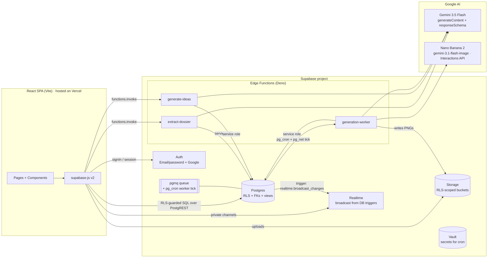

# OREoS — Technical Architecture (Supabase + Gemini API)

**Phase 2 deliverable, v2** · 2026-07-05 · Supersedes the Firebase plan (archived at [archive/firebase-plan/](archive/firebase-plan/)) after the stack decision: **Supabase backend + Gemini Developer API**. Gemini findings in [RESEARCH_BRIEF.md](RESEARCH_BRIEF.md) still apply verbatim; Supabase specifics verified against current docs 2026-07-05.

---

## 1. System Overview

**One sentence:** the SPA reads/writes Postgres directly under Row-Level Security; Edge Functions exist only where a server must act (Gemini calls, scraping, queue work); the `GEMINI_API_KEY` lives in Edge Function secrets and never reaches a browser.

## 2. End-to-End Data Flow (unchanged UI, new plumbing)

| # | Step | UI (built) | Backend behavior |
|---|------|-----------|------------------|
| 1 | **Ingestion** | `ProductIntakePage` | Image → Storage `uploads` bucket (RLS: members, `image/*`, ≤ 15 MB), then `functions.invoke("extract-dossier")`. URL → the function fetches + parses og:meta **server-side**. |
| 2 | **Extraction** | `ProductDetailPage` | `extract-dossier`: Storage read / URL fetch → **gemini-3.5-flash** `generateContent` + `responseSchema` (ProductDossier) → Zod validate → `update products set dossier, status` via service role. |
| 3 | **Ideation** | `CreateCampaignModal`, campaign workspace | `generate-ideas`: dossier + brand → 5–7 schema-constrained ideas → `campaign_ideas` rows, `status='proposed'`. |
| 4 | **Approval** | Idea checkboxes, `ApprovalsPage` | Plain client `update` (`proposed→approved/rejected`); a `BEFORE UPDATE` trigger enforces the legal transition and that nothing else changes. Dossier context lives in Postgres — every stage reads it; nothing is "passed". |
| 5 | **Generation** | `AssetsPage`, workspace assets tab | `approve-and-generate` (thin RPC): enqueues one **pgmq** message per approved idea × format + a `generation_jobs` progress row. **pg_cron ticks every 10 s** → `pg_net` invokes `generation-worker`, which `pgmq.read`s a small batch (visibility timeout = retry safety), calls **Nano Banana 2** (Interactions API, brand reference images) + 3.5-flash copy, uploads PNG to `assets` bucket, inserts `assets` row (`pending-review`), archives the message. |

Queue rationale (unchanged): Gemini image-model rate limits + rolling 10-min spend caps demand sequential, retryable, idempotent processing. pgmq gives visibility-timeout retries; job idempotency key = `(campaign_id, idea_id, format)` unique index; worker keeps each invocation to ~1 image to stay far inside Edge Function wall-clock limits.

## 3. Service Map

| Concern | Supabase primitive | Notes |
|---|---|---|
| Identity | Auth (email/password + Google) | `on auth.users insert` trigger creates profile + personal workspace — **native DB trigger, no bootstrap callable needed** (an improvement over the Firebase plan) |
| Domain state | Postgres tables + FKs | schema in [SCHEMA.md](SCHEMA.md); mirrors `src/types` 1:1 |
| Campaign/dashboard counts | **SQL views** over `assets` | the mock's derived-consistency invariant becomes `campaign_stats` / `workspace_stats` views — always correct, zero triggers to maintain |
| Authorization | RLS on every table + Storage policies | `security definer` helper `private.member_role(ws_id)` avoids policy recursion (current documented pattern) |
| Server logic | Edge Functions (Deno, `npm:@google/genai`) | `verify_jwt` on; membership re-checked server-side; service-role client for writes |
| Queue | pgmq + pg_cron + pg_net | Supabase's own documented pattern for AI job processing |
| Realtime | **Broadcast from database** (`realtime.broadcast_changes` triggers) on private channel `workspace:{id}` | `postgres_changes` deliberately avoided — current docs discourage it for new apps (scaling) |
| Files | Storage buckets `uploads`, `generated`, `branding` | `generated` is client-read-only; only the worker (service role) writes |
| Secrets | Edge Function secrets (`GEMINI_API_KEY`) + Vault (cron's function URL/key) | never in client env, never in migrations |
| SPA hosting | **Vercel** (default; connector available in this workspace) | Supabase hosts no static sites; any static host works |

## 4. Gemini Integration

Identical to the research brief — same models, same output contracts, same failure policy (one schema-validation retry → `needs-review`, never partial writes). Only the caller changes: Deno Edge Functions import `npm:@google/genai`, key from `Deno.env.get("GEMINI_API_KEY")` (set via `supabase secrets set`). Vertex AI remains a later drop-in (same SDK, constructor flag) if enterprise controls are ever needed.

### 4.1 Gemini Managed Agents — evaluated (2026-07-05)

The Gemini API now offers **Managed Agents**: a server-side agent harness (base agent `antigravity-preview-05-2026` on Gemini 3.5 Flash) configured once via `agents.create()` (system instructions, code-execution/search/`url_context` tools, MCP servers, function calling) and invoked by ID through the Interactions API, with sandboxed autonomous execution and `background=true` long-running mode.

**Decisions:**
- **Adopt `url_context` now, as a plain tool** — it attaches to ordinary `generateContent` calls without the agent harness. `extract-dossier` passes the product URL with the `url_context` tool enabled and lets Gemini read the page itself. This deletes our hand-rolled og:meta scraper and its "flaky scraping" risk from Sprint B2.
- **Do not put managed agents in the v1 pipeline.** Extraction/ideation/copy are deterministic single-shot JSON tasks — `responseSchema` calls are cheaper, faster, schema-guaranteed, and GA. An autonomous sandboxed agent adds latency and preview-status churn for zero benefit there; image generation is Nano Banana regardless.
- **Earmark managed agents for v2 features** that are genuinely agentic and already in the nav spec: **AI Chat** ("Ask OREoS" over workspace data via function-calling tools into Postgres) and **AI Recommendations** (background analysis producing suggestions). Revisit when the base agent exits preview (current limits: one base agent, no versioning, 1,000 agents/account).

## 5. Security Model

1. **Auth** — Supabase Auth JWT; `auth.uid()` inside every policy.
2. **RLS everywhere** — every table default-deny with explicit policies:
   - read = workspace member; write = `editor|owner`; member management = `owner` only (can't demote self / the workspace owner).
   - **Column protection**: dossier, statuses set by pipeline, and any stat-bearing column are updatable only by service role (policies + `BEFORE UPDATE` triggers rejecting illegal column changes).
   - **State machines in triggers**: idea `proposed→approved|rejected` (client) and asset `draft→pending-review→approved→scheduled` (client) with `published` reachable only by service role — same lifecycle the UI already renders.
3. **Storage RLS** — path convention `{workspace_id}/…` checked against membership; MIME + size limits on upload buckets; `generated` bucket write-locked to service role.
4. **Edge Functions** — JWT verified; workspace membership re-checked against the DB before acting (never trust a client-sent `workspace_id`); service-role key only in function env.
5. **Postgres hygiene** — helpers in a `private` schema (not exposed via PostgREST), `search_path` pinned, indexes on every column used in RLS policies.
6. **Audits** — Supabase **security advisors** run at the end of every sprint (available directly via the Supabase connector in this workspace); RLS policies get pgTAP tests in CI.

## 6. State Management (unchanged decision, new transport)

React Context + live queries. Each page swaps `useState(seedData)` for a fetch of the workspace-scoped query plus a subscription to the `workspace:{id}` **private broadcast channel** to refresh on change events (`asset_created`, `job_updated`, `notification_created`…). Filtering/sorting/pagination logic already built stays as-is. `SessionContext` = session + active workspace + role.

## 7. Key Decisions Register (v2 deltas)

| Decision | Choice | Why |
|---|---|---|
| Backend | **Supabase (Postgres)** | Relational schema fit; RLS; free-tier dev; MCP-provisionable from this workspace |
| AI access | **Gemini Developer API** (not Vertex) | Same models; API-key auth is the natural fit from Deno; Vertex is a later constructor-flag swap |
| Counts | **SQL views**, not denormalized counters | FKs + aggregates make the consistency invariant structural |
| Queue | pgmq + pg_cron worker tick | Documented Supabase pattern; visibility-timeout retries; respects wall-clock limits |
| Realtime | Broadcast-from-DB triggers, private channels | Current guidance; `postgres_changes` discouraged for new apps |
| User bootstrap | `auth.users` insert trigger | Native in Postgres; simpler than the Firebase workaround |
| SPA hosting | Vercel | Static host needed; connector already authorized here |
| Types | `supabase gen types typescript` | Generated DB types checked against `src/types` at the seam |

**Deliberately deferred:** social publishing OAuth, Stripe billing, pgvector (dossier similarity search is a natural v2 with embeddings), multi-region, org-level SSO.
