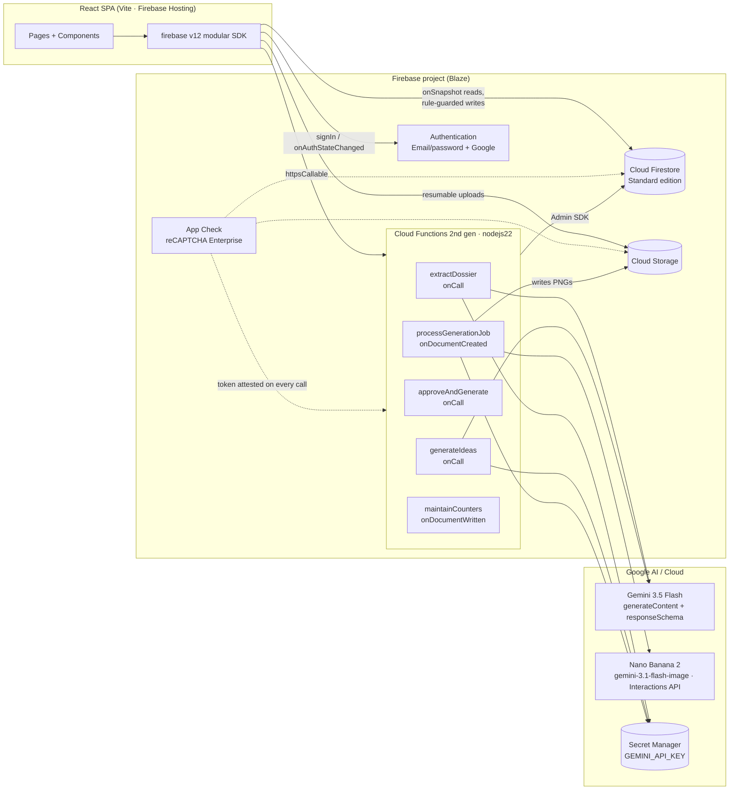

# OREoS — Technical Architecture

**Phase 2 deliverable** · 2026-07-05 · Grounded in [RESEARCH_BRIEF.md](RESEARCH_BRIEF.md) (verified SDK/model versions) and the shipped UI (10 routes, types in `src/types/index.ts`).

---

## 1. System Overview

**One sentence:** the SPA talks to Firestore/Storage directly for everything rule-expressible, and calls Cloud Functions only where a server must act (Gemini calls, cross-document invariants, scraping) — Gemini API keys never leave Secret Manager.

## 2. End-to-End Data Flow (maps 1:1 to shipped UI)

| # | Step | UI (already built) | Backend behavior |
|---|------|--------------------|------------------|
| 1 | **Ingestion** | `ProductIntakePage` (URL / image upload) | Image: client uploads to `ws/{wsId}/uploads/…` via Storage SDK (rules validate type/size), then calls `extractDossier`. URL: `extractDossier` fetches + parses metadata **server-side** (never client-side CORS scraping). |
| 2 | **Extraction** | `ProductDetailPage` dossier view | `extractDossier` (onCall): loads image bytes from Storage (20 MB inline ceiling respected), calls **gemini-3.5-flash** `generateContent` with `responseSchema` matching `ProductDossier`, validates with Zod, writes to `products/{id}.dossier`, flips `status: processing → ready / needs-review`. |
| 3 | **Ideation** | `CreateCampaignModal`, campaign workspace | `generateIdeas` (onCall): dossier + brand doc → 5–7 ideas, JSON-schema constrained, written to `campaigns/{id}/ideas/*` with `status: "proposed"`. |
| 4 | **Approval** | Ideation checkboxes, `ApprovalsPage` | Pure Firestore writes from the client (`status: proposed → approved`), rule-validated state transition. **Dossier context is never "passed" — it lives in Firestore and every stage reads it** (satisfies the no-losing-context constraint). |
| 5 | **Generation** | `AssetsPage`, campaign workspace assets tab | `approveAndGenerate` (onCall) fans **into a Firestore job queue** (`generation_jobs`), one doc per approved idea × format. `processGenerationJob` (onDocumentCreated) executes jobs **sequentially per workspace**, calling **gemini-3.1-flash-image** (Interactions API, brand refs attached) + gemini-3.5-flash for copy; saves PNG to Storage, creates `assets/*` doc with `status: "pending-review"`. |

The job queue exists because of the **rolling 10-minute spend caps** and low image-model rate limits (research brief §2.5): a burst of 7 ideas × 3 formats must throttle, survive retries, and be idempotent (job doc ID = `{campaignId}_{ideaId}_{format}`, processor exits early if a terminal status is present).

## 3. Firebase Service Map

| Service | Owns | Notes |
|---|---|---|
| **Authentication** | Identity, sessions | Email/password + Google provider. ⚠️ Gen-2 functions have **no `auth.onCreate` trigger** — user profile + personal workspace are created by a `bootstrapWorkspace` callable on first sign-in (idempotent), not by a trigger. |
| **Firestore (Standard)** | All domain state + job queue + notifications | Standard edition: mature rules/emulator; our access pattern is owner-scoped docs + real-time listeners — Enterprise's pipelines add nothing for v1. |
| **Storage** | Product uploads, generated assets, logos | Path-scoped per workspace; rules enforce membership, `image/*`, ≤ 15 MB uploads. |
| **Cloud Functions gen 2** | Gemini calls, scraping, queue processing, counter maintenance | `nodejs22`, `firebase-functions` v7, `firebase-admin` v14. Secrets via `defineSecret("GEMINI_API_KEY")`. `enforceAppCheck: true` on every callable. |
| **Hosting** | SPA delivery | `dist/` + SPA rewrite. App Hosting not needed (no SSR). |
| **App Check** | Abuse protection | reCAPTCHA Enterprise; enforced on Functions first, then Firestore/Storage once soak-tested. |

## 4. Gemini Integration (server-side only)

| Task | Model | API | Output contract |
|---|---|---|---|
| Dossier extraction (image+text) | `gemini-3.5-flash` | `generateContent` | `responseSchema` = ProductDossier JSON schema; Zod-validated before any Firestore write |
| Campaign ideation | `gemini-3.5-flash` | `generateContent` | schema: array of 5–7 `{title, description, format, platforms[], rationale}` |
| Copywriting per asset | `gemini-3.5-flash` | `generateContent` | schema: `{caption, hashtags[], cta}` |
| Image generation | `gemini-3.1-flash-image` (Nano Banana 2) | **Interactions API** | product photo + brand palette passed as reference images (supports up to 14) |

Failure policy: every Gemini call gets one schema-validation retry with the validator error appended; a second failure marks the job/doc `needs-review` — **never** a silent partial write. All calls log `{workspaceId, jobId, model, latencyMs, tokens}` (no prompt bodies with user data at info level).

## 5. Multi-Tenancy & Security Model

**Tenancy shape:** everything lives under `workspaces/{wsId}/…` subcollections (schema in [SCHEMA.md](SCHEMA.md)). Membership = `workspaces/{wsId}/members/{uid}` doc with `role: owner|editor|viewer` — exactly the `TeamRole` the Settings UI already uses.

**Why membership docs, not custom claims:** roles are editable in the Team UI in real time; claims would need a function round-trip + token refresh on every change. Rules read membership via `get()` (1 extra read per request, acceptable; cached within a single rules evaluation).

**Layers:**
1. **Auth** — signed-in user identity (`request.auth.uid`).
2. **App Check** — request provenance on callables (`enforceAppCheck`, later Firestore/Storage).
3. **Firestore rules** — default deny; membership + role gates; **validator-function pattern on every create AND update** (strict `hasOnly` schemas, size limits on every string/list, immutable `ownerUid`/`createdAt`, enum + status-transition checks — per the official rules skill). Draft in SCHEMA.md; `firebase-security-rules-auditor` runs before every rules deploy.
4. **Storage rules** — membership-scoped paths, content-type + size validation; generated-asset paths are **client-read-only** (only the Admin SDK writes them).
5. **Functions IAM** — dedicated runtime service account per deploy with only: Firestore user, Storage object admin (scoped bucket), Secret accessor. Callables re-verify membership server-side (never trust client-sent `workspaceId` without checking the member doc).
6. **Secrets** — `GEMINI_API_KEY` in Secret Manager (`functions:secrets:set`); nothing in client bundles or git.

## 6. Consistency Strategy (the mock pattern, made real)

The UI's core invariant — *campaign counts ≡ asset collection contents* (derived mock data) — maps to:

- **Source of truth:** `assets` subcollection docs.
- **Campaign stat chips (assets/scheduled/published):** maintained by `maintainCounters` (`onDocumentWritten` on assets) writing denormalized counts onto the campaign doc — dashboards read one doc, stay real-time, and survive 356+ assets without N reads.
- **Ad-hoc numbers** (filtered stats rows): client `getCountFromServer()` aggregate queries where a listener would be wasteful.
- Trigger is idempotent (recomputes from a count aggregate rather than incrementing blindly), so at-least-once delivery is safe.

## 7. State Management (decision)

**React Context + `onSnapshot` listeners; no Zustand.** Firestore *is* the store: each page swaps its `useState(seedData)` for a `useCollection`-style hook subscribed to the workspace-scoped query, and the existing filter/sort/pagination logic keeps working on the live array. Auth + current-workspace live in one `SessionContext`. This was pre-approved as the recommendation in the research brief; nothing in the shipped UI needs cross-page client state beyond that.

## 8. Key Decisions Register

| Decision | Choice | Why |
|---|---|---|
| Firestore edition | **Standard** | Mature rules + emulator; no need for pipelines/Mongo API |
| Assets location | `workspaces/{ws}/assets` (flat per workspace, `campaignId` field) | The Assets Library queries across campaigns; campaign views filter by one field — both are single-where queries |
| Ideas location | `campaigns/{id}/ideas` subcollection | Never queried across campaigns; lifecycle bound to parent |
| Generation | Firestore-backed job queue, sequential per workspace | Rate limits + spend caps + idempotency + retryable |
| User bootstrap | Idempotent callable, not auth trigger | Gen-2 has no `auth.onCreate`; blocking functions overkill |
| Roles | Membership docs read in rules | Real-time role edits from the Team UI |
| Counters | Trigger-maintained denormalization | Real-time dashboards without fan-out reads |
| Gemini APIs | `generateContent` (JSON) + Interactions (images) | Per current Google guidance — legacy-but-recommended vs. required for Nano Banana |

**Deliberately deferred:** scheduled publishing to social platforms (needs per-platform OAuth apps — v2), Stripe billing, Firestore TTL on jobs, multi-region.
